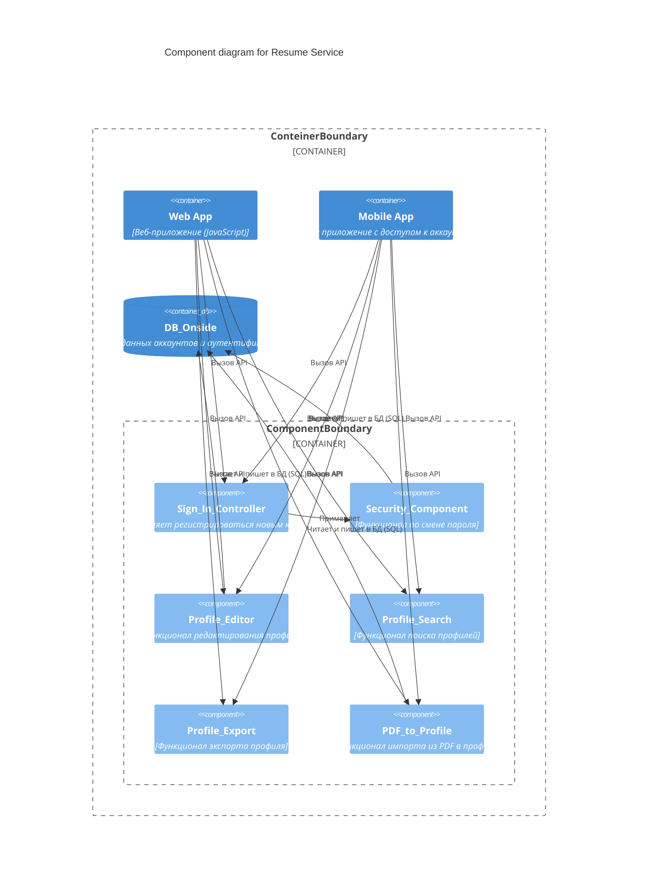

```mermaid
    C4Context
      title Component diagram for Resume Service
      Container_Boundary(b0, "ConteinerBoundary") {
        Container(WebApp, "Web App", "Веб-приложение (JavaScript)")
        Container(MobileApp, "Mobile App", "Мобильное приложение с доступом к аккаунту  (Kotlin)")
        Container_Boundary(b1, "ComponentBoundary") {
            
            Component(Sign_In_Controller, "Sign_In_Controller", "Позволяет регистрироваться новым юзерам")
            Component(Security_Component, "Security_Component", "Функционал по смене пароля")
            Component(Profile_Editor, "Profile_Editor", "Функционал редактирования профиля")
            Component(Profile_Search, "Profile_Search", "Функционал поиска профилей")
            Component(Profile_Export, "Profile_Export", "Функционал экспорта профиля")
            Component(PDF_to_Profile, "PDF_to_Profile", "Функционал импорта из PDF в профиль")
        }
        ContainerDb(DB_Onside, "DB_Onside", "База данных аккаунтов и аутентификации")
}

Rel(WebApp, Sign_In_Controller, "Вызов API")
Rel(MobileApp, Sign_In_Controller, "Вызов API")
Rel(Sign_In_Controller, Security_Component, "Применяет")
Rel(WebApp, Profile_Editor, "Вызов API")
Rel(MobileApp, Profile_Editor, "Вызов API")
Rel(WebApp, Profile_Search, "Вызов API")
Rel(MobileApp, Profile_Search, "Вызов API")

Rel(WebApp, Profile_Export, "Вызов API")
Rel(MobileApp, Profile_Export, "Вызов API")
Rel(WebApp, PDF_to_Profile, "Вызов API")
Rel(MobileApp, PDF_to_Profile, "Вызов API")

Rel(Security_Component, DB_Onside, "Читает и пишет в БД (SQL)")
Rel(Profile_Editor, DB_Onside, "Читает и пишет в БД (SQL)")
Rel(PDF_to_Profile, DB_Onside, "Читает и пишет в БД (SQL)")

UpdateLayoutConfig($c4ShapeInRow="3", $c4BoundaryInRow="1")
```