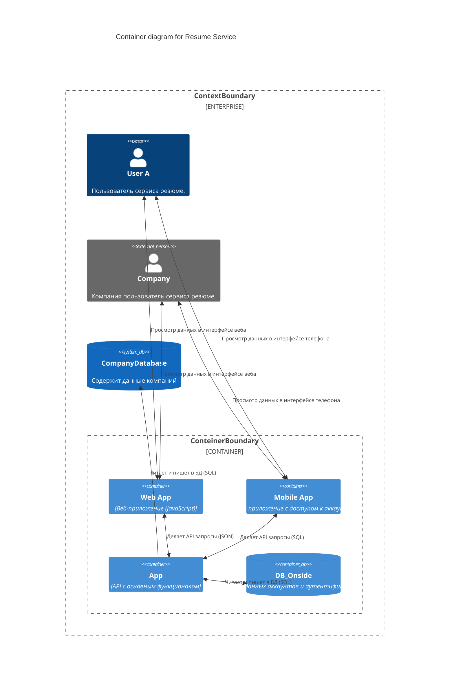

```mermaid
    C4Context
      title Container diagram for Resume Service
      Enterprise_Boundary(b0, "ContextBoundary") {
        Person(userA, "User A", "Пользователь сервиса резюме.")
        Person_Ext(Company, "Company", "Компания пользователь сервиса резюме.")
        Container_Boundary(b1, "ConteinerBoundary") {
            Container(WebApp, "Web App", "Веб-приложение (JavaScript)")
            Container(MobileApp, "Mobile App", "Мобильное приложение с доступом к аккаунту  (Kotlin)")
            Container(MainApp, "App", "API с основным функционалом")
            ContainerDb(DB_Onside, "DB_Onside", "База данных аккаунтов и аутентификации")
        }
        SystemDb(CompanyDatabase, "CompanyDatabase", "Содержит данные компаний")
}

BiRel(userA, WebApp, "Просмотр данных в интерфейсе веба")
UpdateRelStyle(userA, WebApp, $offsetY="-20", $offsetX="0")
BiRel(userA, MobileApp, "Просмотр данных в интерфейсе телефона")
BiRel(Company, WebApp, "Просмотр данных в интерфейсе веба")
UpdateRelStyle(Company, WebApp, $offsetY="-40", $offsetX="0")
BiRel(Company, MobileApp, "Просмотр данных в интерфейсе телефона")
UpdateRelStyle(Company, MobileApp, $offsetY="20", $offsetX="0")
BiRel(WebApp, MainApp, "Делает API запросы (JSON)")
BiRel(MobileApp, MainApp, "Делает API запросы (SQL)")
BiRel(MainApp, DB_Onside, "Читает и пишет в БД (SQL)")
Rel(MainApp, CompanyDatabase, "Читает и пишет в БД (SQL)")

UpdateLayoutConfig($c4ShapeInRow="4", $c4BoundaryInRow="1")
```
