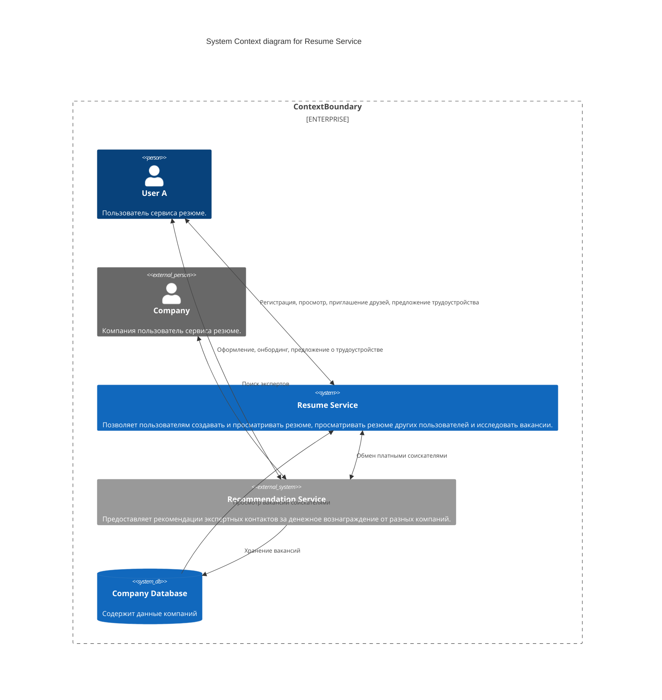

```mermaid
C4Context
      title System Context diagram for Resume Service
      Enterprise_Boundary(b0, "ContextBoundary") {
        Person(userA, "User A", "Пользователь сервиса резюме.")
        Person_Ext(Company, "Company", "Компания пользователь сервиса резюме.")
        System(resumeService, "Resume Service", "Позволяет пользователям создавать и просматривать резюме, просматривать резюме других пользователей и исследовать вакансии.")
        System_Ext(recommendationService, "Recommendation Service", "Предоставляет рекомендации экспертных контактов за денежное вознаграждение от разных компаний.")
        SystemDb(CompanyDatabase, "Company Database", "Содержит данные компаний")
}

BiRel(userA, resumeService, "Регистрация, просмотр, приглашение друзей, предложение трудоустройства")
BiRel(userA, recommendationService, "Оформление, онбординг, предложение о трудоустройстве")
UpdateRelStyle(userA, recommendationService, $offsetY="0", $offsetX="-20")
BiRel(Company, recommendationService, "Поиск экспертов")
UpdateRelStyle(Company, recommendationService, $offsetY="-50", $offsetX="0")
BiRel(resumeService, recommendationService, "Обмен платными соискателями")
Rel(recommendationService, CompanyDatabase, "Хранение вакансий")
Rel(CompanyDatabase, resumeService, "Просмотр вакансий соискателями")
UpdateRelStyle(CompanyDatabase, resumeService, $offsetY="0", $offsetX="-50")


UpdateLayoutConfig($c4ShapeInRow="3", $c4BoundaryInRow="1")
```